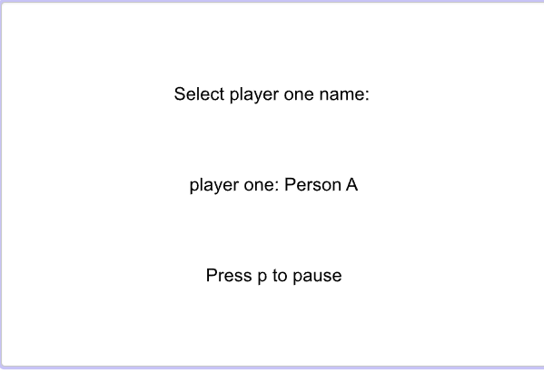
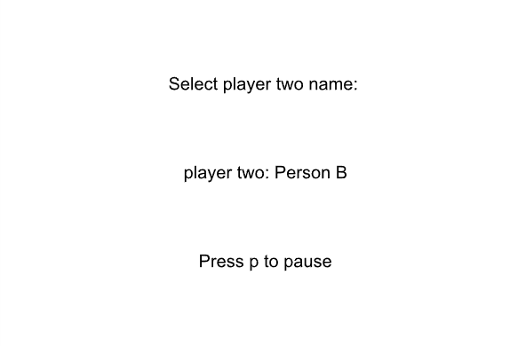
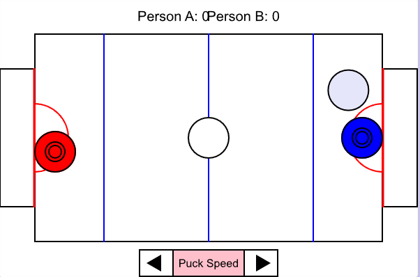

# Air-Hockey-Project

This is the first project I have worked on with Python. In this project, I created a two player air hockey game controlled with wasd and the arrow keys.

[Play Air Hockey](https://academy.cs.cmu.edu/sharing/midnightBlueFish775507)

Features
- Movements using wasd and arrow keys.
- Physics for the hockey puck including collisions and friction.
- Score Keeping.

Technologies
- Python
- CMU CS Academy
- cmu_graphics

Screenshots

- During this project, I wasn't able to work with many integral parts of programming.
- However, I've learned many things since the creation of this project.
- One of the biggest problems that I was unable to solve in this project was the puck clipping through the walls.
- Now with more experience in programming and game design, I would fix this problem by prioritizing the puck's inability to move in the direction of the wall.
- In addition, I'd decrease the size of the player or increase the size of the puck so that the puck could still be pushed out of corners.
- Furthermore, I would include a control to reset the position of both the pucks and the players as a failsafe.
